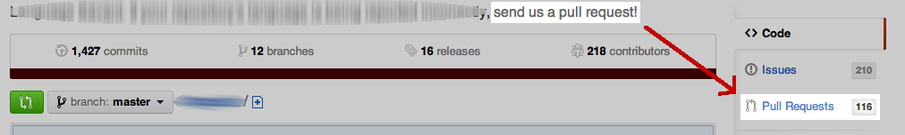
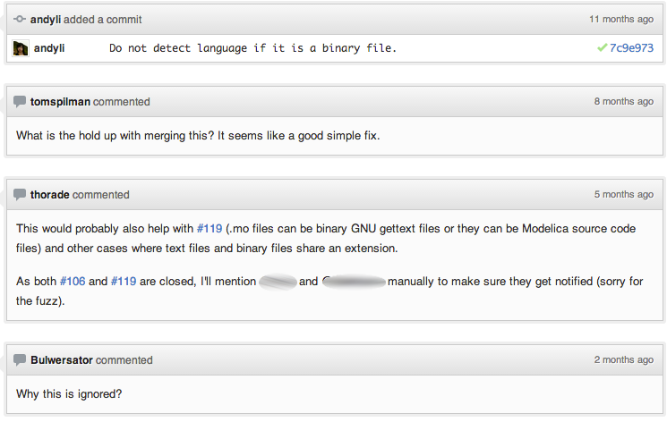
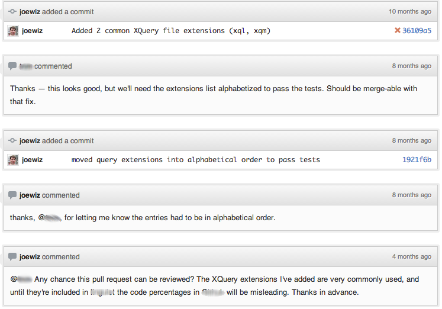

 **How to discourage open source contributions** | [Patreon](https://patreon.com/danluu)
* * *
 

What's the first thing you do when you find a bug or see a missing feature in an open source project? Check out the project page and submit a patch!

 

 

Oh. Maybe their message is so encouraging that they get hundreds of pull requests a week, and the backlog isn't that bad.

 

 

Maybe not. Giant sucker than I am, I submitted a pull request even after seeing that. All things considered, I should consider myself lucky that it's possible to [submit pull requests at all](http://www.jwz.org/blog/2013/02/wow-remember-when-people-tracked-bugs-welcome-to-the-next-level/). If I'm really lucky, maybe they'll get around to [looking at it one day](http://www.jwz.org/doc/cadt.html).

I don't mean to pick on this particular project. I can understand how this happens. You're a dev who can merge pull requests, but you're not in charge of triaging bugs and pull requests; you have a day job, projects that you own, and a life outside of coding. Maybe you take a look at the repo every once in a while, merge in good pull requests, and make comments on the ones that need more work, but you don't look at all 116 open pull requests; who has that kind of time?

 

This behavior, eminently reasonable on the part of any individual, results in a systemic failure, a tax on new open source contributors. I often get asked how to get started with open source. It's easy for me to forget that getting started can be hard because the first projects I contributed to have a response time measured in hours for issues and pull requests[1](#fn:1). But a lot of people have experiences which aren't so nice. They contribute a few patches to a couple projects that get ignored, and have no idea where to go from there. It doesn't take [egregious individual behavior](http://lostechies.com/derickbailey/2012/12/14/dear-open-source-project-leader-quit-being-a-jerk/) to create a hostile environment.

 

That's kept me from contributing to some projects. At my last job, I worked on making a well-known open source project production quality, fixing hundreds of bugs over the course of a couple months. When I had some time, I looked into pushing the changes back to the open source community. But when I looked at the mailing list for the project, I saw a wasteland of good patches that were completely ignored, where the submitter would ping the list a couple times and then give up. Did it seem worth spending a week to disentangle our IP from the project in order to submit a set of patches that would, in all likelihood, get ignored? No.

 

If you have commit access to a project that has this problem, please [own the process](http://en.wikipedia.org/wiki/Diffusion_of_responsibility) for incoming pull requests (or don't ask for pull requests in your repo description). It doesn't have to permanent; just until you have a system in place[2](#fn:2). Not only will you get more contributors to your project, you'll help break down one barrier to becoming an open source contributor.

 

 

 

For an update on the repo featured in this post, [check out this response to a breaking change](//danluu.com/everything-is-broken/#github).

 
* * *
 
1. Props to [OpenBlas](https://github.com/xianyi/OpenBLAS), [Rust](https://github.com/mozilla/rust), [jslinux-deobfuscated](https://github.com/levskaya/jslinux-deobfuscated), and [np](https://github.com/softprops/np) for being incredibly friendly to new contributors. [[return]](#fnref:1)
2. I don't mean to imply that this is trivial. It can be hard, if your project doesn't have an accepting culture, but there are [popular, high traffic projects that manage to do it](http://paulmillr.com/posts/github-pull-request-stats/). If all else fails, you can always try [the pull request hack](http://felixge.de/2013/03/11/the-pull-request-hack.html). [[return]](#fnref:2)

 
 
 [← Why hardware development is hard](https://danluu.com/hardware-unforgiving/) [Randomize HN →](https://danluu.com/randomize-hn/) 
 
 [Archive](https://danluu.com/) [Mastodon](https://mastodon.social/@danluu) [Bluesky](https://bsky.app/profile/danluu.com) 
 
 [Patreon](https://www.patreon.com/danluu) [LinkedIn](https://www.linkedin.com/in/danluu/) [Twitter](https://twitter.com/danluu/) [RSS](https://danluu.com/atom.xml)
 