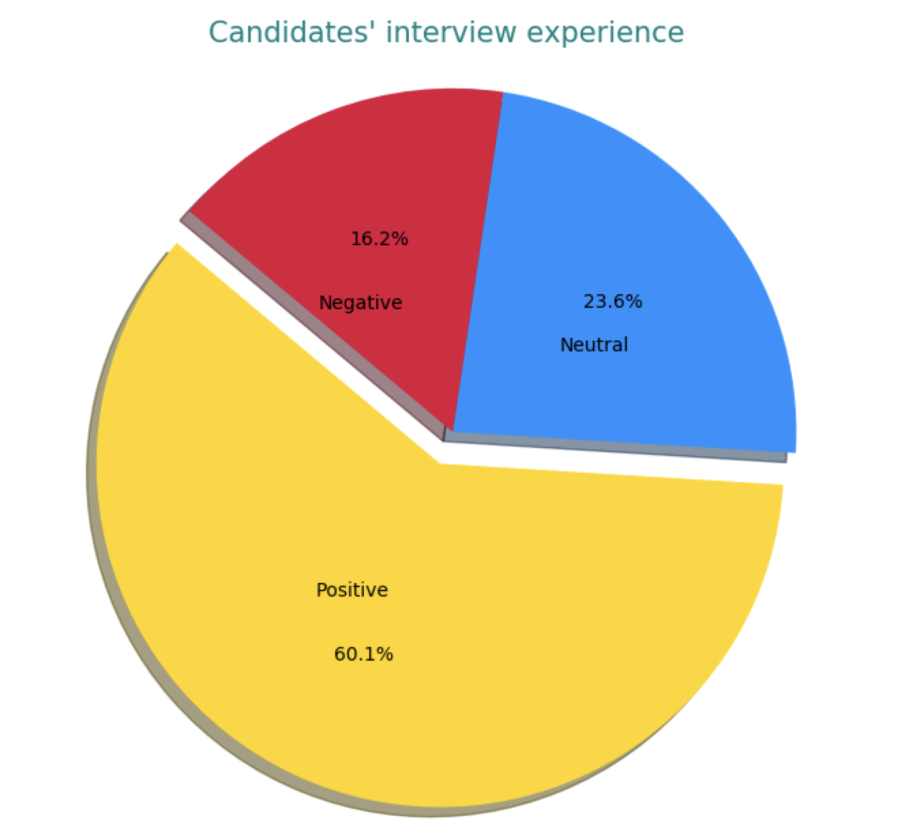
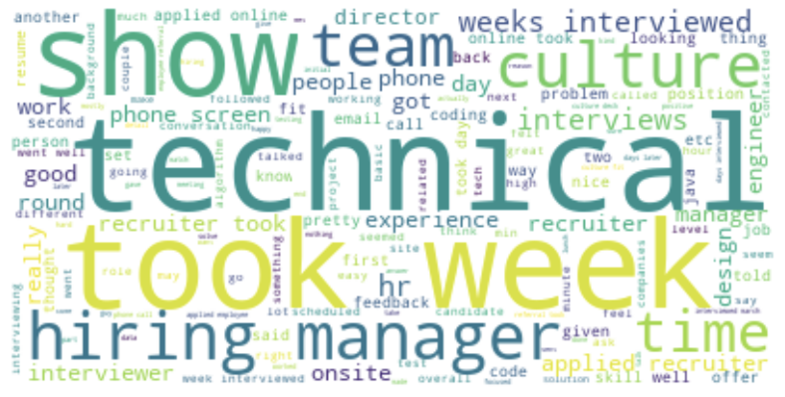

[Chip Huyen](/)
[Blog](/blog/)[Books](/books/)[Events](/events/)
AI Guide
- [AI Roadmap](/mlops/)
- [Llama Police](/llama-police)
- [ML Interviews](https://huyenchip.com/ml-interviews-book/)

[List 100](/list-100/)[VN](https://huyenchip.com/vn/)

# What Glassdoor interview reviews reveal about tech hiring cultures

Aug 21, 2019 • Chip Huyen

[_[Twitter thread](https://twitter.com/chipro/status/1164399256960061446), [Reddit discussion](https://www.reddit.com/r/programming/comments/cu1dag/what_glassdoor_interview_reviews_reveal_about/)_]

During the process of working on [my book on machine learning interviews](https://huyenchip.com/2019/07/21/machine-learning-interviews.html), one question that I’ve been asked many times by candidates is the onsite-to-offer ratio, e.g. what percentage of people who interview at a company eventually get an offer. Another number that recruiters and hiring managers are keen to know is the yield rate on offers of different companies – e.g. what percentage of people who are extended an offer by a company accept that offer?

Those numbers are undoubtedly tracked by HR within each company, but as far as I know, no company volunteers this information. I decided to approximate those numbers using the largest public aggregator of interviews that I know of: Glassdoor. This is far from a perfect resource because of the following biases:

- few people actually leave reviews for anything online
- those who do are likely compelled by either a really good or really bad experience
- those who receive offers are more likely to give reviews than those who don’t
- those who accept offers are more likely to give reviews than those who decline
- junior candidates are more likely to give reviews than senior candidates

However, hopefully a large number of reviews might be able to smoothen out some of the noise. Moreover, if all reviews suffer from the same biases, they are still useful for comparison across companies.

This post consists of 6 parts:

1. **Data** : description of the dataset.
2. **Interview results** : onsite-to-offer ratio and offer yield rate.
3. **Sourcing candidates** : how candidates are recruited for onsite interviews. The sources include campus recruiting, online application, referrals, staffing agency, and inhouse recruiters.
4. **Interview experience** : which company gives candidates the best and the worst experiences.
5. **Interview difficulty** : which company has the most difficult interviews.
6. **What candidates say about each company**.

## Data

I focus only on software engineering related roles such as Software Engineer and Data Scientist, for both junior and senior levels (though the majority is junior). For each review, the following information is collected:

- **Result** : No offer / declined offer / accepted offer
- **Difficulty** : Easy interview / medium interview / hard interview
- **Experience** : Negative / neutral / positive
- **Review** : including application process, interview process, interview questions

I discarded all reviews with missing values. I was able to gather **15,897** reviews from **27** major tech companies with at least **100** reviews for software engineering related roles. Technically, a review can come from a candidate at any point in the interviewing process, but review samples suggest that most of the reviews are from candidates that have done onsites, so interviews in this analysis will be treated as such.

Below is the aggregated count for all SWE-related roles at each company. The number of reviews seem proportional to the number of SWEs each company hires. The largest SWE employers are, unsurprisingly, Google, Amazon, Facebook, and Microsoft. The relatively small number of reviews for Apple and Netflix compared to other FAANG companies are because:

1. Apple is not a software company.
2. Netflix is actually not that big (~6,000 employees compared to ~40,000 employees at Facebook).

You can see the raw count of reviews for each role at each company [here](https://docs.google.com/spreadsheets/d/1IvfC5OnlBSycb2uHknuj4JaE03a2Tm22Cqc3voF04Vg/edit?usp=sharing).

_Glassdoor software engineering interview count for major tech companies_

The first thing to notice from this dataset is that interview feedback varies widely for different roles even within the same companies. For example, only **25.4%** of candidates for the role of Data Scientist at Facebook find their interviews difficult, but that number is 36.4% for the role of Senior Software Engineer. Similarly, only **51%** of candidates for the role of Senior Software Engineer have a positive experience of their interview process, but **69.5%** of candidates for Data Engineer enjoy the process.

The variability is due to the fact that different roles have different recruiting pipelines (e.g. senior roles rely more on recruiters cold-emailing while junior roles rely more on campus recruiting), different expectations, and different interviewing processes. Some companies have the same process for the entire company and new hires go through a team matching process after joining, but most companies let each team conduct their hiring separately, which leads to more variations within the same company.

Before you continue reading this post, I hope that you take all the biases and variations in these reviews into account. The findings are not conclusive and are up for discussion.

## Interview results

The first thing I wanted to know is onsite-to-offer ratios (the percentage of onsites that lead to offers) and offer yield rates (the percentage of offers that are accepted by candidates).

From the graph, **18.83%** of onsite candidates at Google get offers, and out of all those with offers, **70%** accept their offers. Due to the biases of online reviews listed above, we should expect the actual numbers to be much lower. From talking to recruiters I know + reading sources online, I gather that the onsite-to-offer ratios here are a few percentage points higher than the actual percentages. E.g. [this](https://www.teamblind.com/article/Whats-the-onsite-to-offer-ratio-at-your-company-MsLHK2xF) and [this](https://www.teamblind.com/article/Acceptance-rate-after-Google-on-site-YUokaj7w) claim that the onsite-to-offer ratio for Google is 10-20% and Amazon 20% (keep in mind that they are both from anonymous people on the Internet). Similarly, the offer yield rate of near 90% is unheard of. Recruiters have told me that if you can get 80% of candidates to accept your offers, you’re golden.

The 10 companies with the lowest onsite-to-offer ratios are all Internet giants (Yelp, Google, Facebook, Airbnb, Amazon, etc.) They are also known to be highly selective companies. Companies with high onsite-to-offer ratios aren’t necessarily unselective. They might be more selective during the screening process and only interview candidates that they already know or really like. Onsites are costly, so the higher the onsite-to-offer ratio, the more financially sound the process.

There’s a very strong correlation between the onsite-to-offer ratio and the offer yield rate. If we consider all 27 companies, the correlation is 0.81. If we consider only 10 companies with at least 300 reviews (Apple, Uber, Amazon, Google, Microsoft, Oracle, Yelp, Cisco, IBM, Facebook), the correlation is even higher, 0.89. This means that the higher the onsite-to-offer ratio, the higher the yield rate. This makes sense because if a candidate passes the interview process at selective companies like Google or Facebook, they probably have other attractive offers to choose from. Those selective companies are also known to make competitive offers, which candidates can use to negotiate with companies that they really want to work for.

## Sourcing candidates

The next thing I look into is how companies source candidates. Every single hiring manager I’ve talked to told me that referrals matter a lot. But exactly how much referrals matter vary from company to company, from role to role. Referrals for senior roles matter a lot more referrals for junior roles, which are due to several reasons. First, junior referrals likely come from junior engineers who are less experienced at judging their friends’ abilities. Second, senior roles are expected to shoulder more leadership responsibilities, so personality and culture fit are much more important.

For junior roles, about 10 - 20% of candidates that get to onsites are referred, with Uber leading the chart with almost 30%. For senior roles, that numbers are higher. Salesforce, Uber, and Cisco all have approximately 30% of their senior onsite candidates referred. If we take into account the fact that the number of applicants who are referred into a company is minuscule compared to the number of applicants who apply to the same company by other means, the chance of a referred applicant is so much higher than the chance of a random candidate.

For junior roles, the biggest source for onsite candidates is campus recruiting. Microsoft and Oracle have more than half of their interviewees recruited through campus events such as career fairs and tech talks. Hot Internet companies like Google, Facebook, and Airbnb rely less on campus recruiting, but it still accounts for between 20 and 30% of their onsites. This means that big tech companies concentrate a huge chunk of their recruiting effort to a handful of popular engineering schools (aka the Tech Ivy: Stanford, UC Berkeley, MIT, Caltech, CMU, University of Toronto, University of Waterloo). The students recruited from those schools then refer their former classmates, who in turn refer event more of their former classmates. The circle goes on, turning those major tech companies into a Tech Ivy alumni mixer.

It makes sense for recruiters to target their most promising sources, but it’s statistically gloomy for candidates who don’t go to a popular engineering college or don’t go to college at all. If you’re one of those candidates, my personal suggestion is build up an impossible-to-ignore online portfolio and wait for recruiters to throw themselves at you. Write in-depth technical blog posts or papers, contribute to open-source projects, do hackathons, compete in coding competitions, and most importantly, publish your work so that the world knows what an amazing engineer you are. Around 15 to 25% of onsite candidates for junior roles are sourced by recruiters. For senior roles, these numbers double. If you’ve had years of experience but have no relevant skills/portfolio to attract recruiters or no friends to refer you, you’re in trouble.

If all else fails, submit your applications and hope for the best. Companies that are the friendliest to online applicants are Twitter, Amazon, and Airbnb with roughly half of the onsites being online applicants. Companies among the most likely to say ‘thank you next’ to hopeful online applicants are Facebook, Microsoft, and Oracle.

## Interview experience

Everyone complains that the interview process is broken. It’s not entirely true, at least from the perspective of the candidates who get interviews. 60% of candidates report positive interview experience.

As a company best known for providing sale solutions, Salesforce is apparently very good at selling themselves to candidates. Candidates interviewing at Salesforce are most likely to report positive experiences. Other companies high up in the list include Intel, Adobe, and SAP. The two companies that seem to give candidates the worst interview experience are Netflix and Snap – only one-third of their candidates report positive. However, they are also the two companies with the least amount of reviews, so this observation could be due to selection bias.

There’s a strong correlation (0.75) between the onsite-to-offer ratio and the percentage of positive experiences. If you receive an offer, you are more likely to think fondly of the process. There’s also a strong negative correlation (-0.67) between the ratio of negative interview experiences and offer yield rate.

The more negative experience a candidate has, the less likely they are to accept the offer. If a candidate who receives an offer has a positive interview experience, the probability that they accept the offer is a whopping 87.5%. However, if that candidate has a negative interview experience, the yield rate is only 33.8%.

In general, senior candidates are harder to please than junior candidates. Senior candidates are often interviewers themselves and expect more from their interviewers. This might explain the abysmal Netflix interview experience. While all other companies keep their shares of senior interviews to under one third, Netflix exclusively hire senior positions. Netflix doesn’t have interns. They don’t even hire recent graduates.

## Interview difficulty

At first, I plotted the raw difficulty score calculated by Glassdoor. By this metric, Google and Airbnb interviews are perceived to be the most difficult by candidates, whereas IBM interviews are perceived to be the easiest.

The actual difficulty is more complicated than that. A candidate rejected for a job is more likely to think of interviews for that job as difficult. The correlation between the onsite-to-offer ratio and the percentage of candidates who find the interviews difficult is -0.49.

## What candidates say about each company

I thought it’d be fun to visualize word clouds for each company from all the reviews for that company. I remove the company names and locations from the reviews. Can you guess which word cloud describes which company. The labels are: Google, Netflix, Microsoft, Amazon. The answers are at the end of the article.

---------

---------

---------

1. Amazon
2. Netflix
3. Google
4. Microsoft

This analysis is done as part of my research for my upcoming book on Machine Learning Interviews. You can get more details + sign up to get updates on the book’s progress [here](https://huyenchip.com/2019/07/21/machine-learning-interviews.html).

**Acknowledgements** : _This post is made possible by the kind support of Ben Krause, Miles Brundage, Larissa Schiavo, Karson Elmgren, and several other wonderful people who would like to remain anonymous._

Subscribe

  

https://disqus.com/embed/comments/?base=default&f=chiphuyen&t_i=https%3A%2F%2Fhuyenchip.com%2F2019%2F08%2F21%2Fglassdoor-interview-reviews-tech-hiring-cultures.html&t_u=https%3A%2F%2Fhuyenchip.com%2F2019%2F08%2F21%2Fglassdoor-interview-reviews-tech-hiring-cultures.html&t_d=What%20Glassdoor%20interview%20reviews%20reveal%20about%20tech%20hiring%20cultures&t_t=What%20Glassdoor%20interview%20reviews%20reveal%20about%20tech%20hiring%20cultures&s_o=default#version=b4b86fd8096fd3a413f323515923c7f3
Please enable JavaScript to view the [comments powered by Disqus.](https://disqus.com/?ref_noscript)

- chip@[thiswebsite]
- [chiphuyen](https://github.com/chiphuyen)
- [chipro](https://twitter.com/chipro)
- [chipiscrazy](https://facebook.com/chipiscrazy)
- [huyenchip19](https://instagram.com/huyenchip19)
- [chiphuyen](https://www.linkedin.com/in/chiphuyen)

I help companies deploy machine learning into production. I write about AI applications, tooling, and best practices.

Subscribe

 

